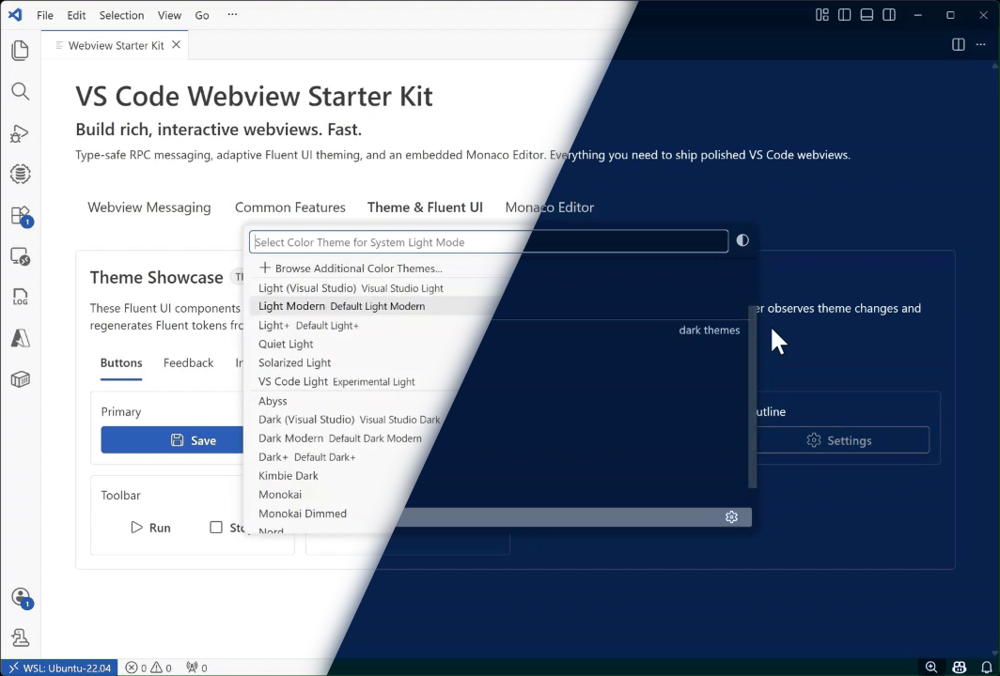
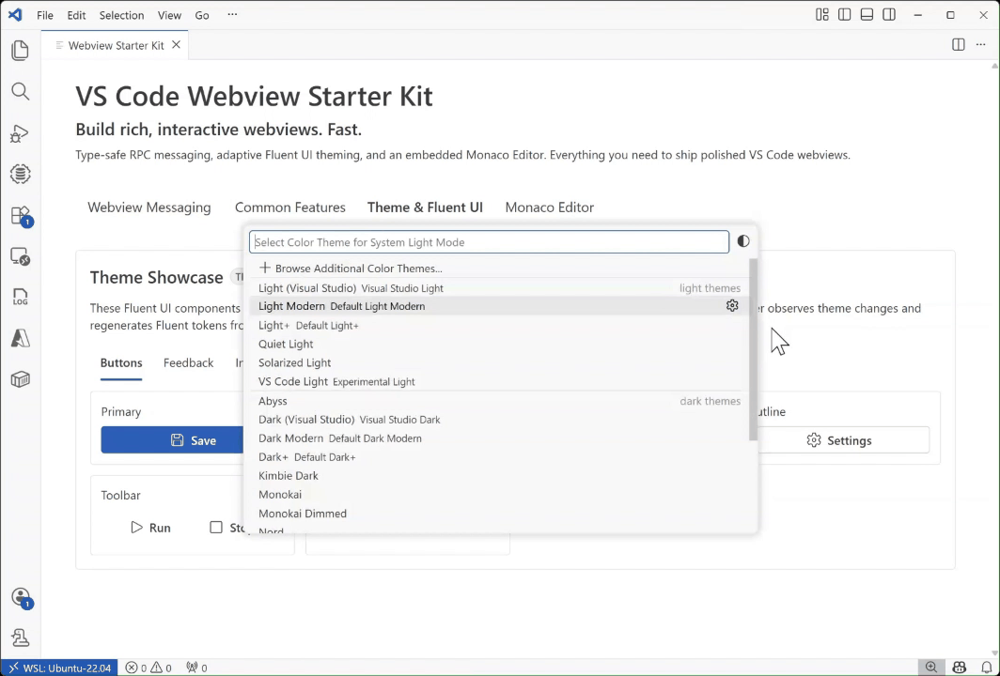

# VS Code Webview Starter Kit

<p align="center"></p>

Build rich, interactive VS Code webviews, fast. This starter kit gives you **type-safe RPC messaging**, **React + Fluent UI** with **adaptive theming**, and an embedded **Monaco Editor**, all wired up and ready to go.

This project was extracted from the webview infrastructure powering [DocumentDB for VS Code](https://github.com/microsoft/vscode-documentdb/) Extension and [Azure Cosmos DB](https://github.com/microsoft/vscode-cosmosdb/) Extension. It provides a production-tested foundation for building VS Code webviews with React.

## Table of Contents

- [Features](#features)
- [Getting Started](#getting-started)
- [Project Structure](#project-structure)
- [Development](#development)
- [Debugging](#debugging)
- [Architecture](#architecture)
- [Under the Hood](#under-the-hood)
- [Adding a New View](#adding-a-new-view)
- [Advanced](#advanced)
- [FAQ](#faq)
- [Limitations](#limitations)
- [Future Work](#future-work)
- [License](#license)

## Features

- **Type-safe RPC** - End-to-end typed communication between extension host and webview via `postMessage` (powered by [tRPC](https://trpc.io/))
- **React + Fluent UI** - Modern UI components with VS Code theme integration
- **Adaptive theming** - Automatic theme adaptation using `DynamicThemeProvider`
- **Monaco Editor** - Embedded code editor component
- **Subscriptions & Abort** - Real-time data streaming and cancellable long-running operations
- **Localization** - Full `@vscode/l10n` integration

## Getting Started

```bash
npm install
npm run build
```

Press **F5** to launch the extension in a new VS Code window. The main webview opens automatically on activation.

To reopen it manually (e.g. after closing the panel), use the Command Palette (`Ctrl+Shift+P`):

> **Webview Starter Kit: Open Main View**

## Project Structure

| Folder                | Purpose                                        |
| --------------------- | ---------------------------------------------- |
| `src/`                | Extension host source code                     |
| `src/webviews/`       | React webview components                       |
| `src/webviews/api/`   | Type-safe RPC infrastructure (server + client) |
| `src/webviews/theme/` | Adaptive theming system                        |
| `src/webviews/demo/`  | Demo webview views                             |
| `src/commands/`       | Command handlers                               |
| `l10n/`               | Localization bundles                           |

## Development

| Command                | Purpose                         |
| ---------------------- | ------------------------------- |
| `npm run build`        | TypeScript compilation          |
| `npm run webpack-dev`  | Webpack development build       |
| `npm run watch:ext`    | Watch extension code            |
| `npm run watch:views`  | Watch webview code (dev server) |
| `npm run lint`         | Run ESLint                      |
| `npm run prettier-fix` | Format code                     |
| `npm run test`         | Run Jest tests                  |
| `npm run l10n`         | Rebuild localization bundles    |

### Hot Reloading

Webview code supports **hot reloading** during development. When you run the `watch:views` task (or the combined `Watch` task), changes to React components, styles, and other webview source files are automatically reflected in the running webview - no need to reload the extension host or reopen the panel.

> **Tip:** Run both watchers together with the **Watch** task for the best experience. Extension host code changes still require a restart (`Ctrl+Shift+F5`).

## Debugging

Press **F5** to launch the extension in a new VS Code window using the **Launch Extension (webpack)** configuration.

### Extension Host

The extension host code (Node.js) can be debugged directly in VS Code using breakpoints. Note that the `STOP_ON_ENTRY` environment variable in `launch.json` can be set to `"true"` to pause execution at the first line of the `activate()` function. This is needed to debug activation code because the environment takes a long time to load, and regular breakpoints in activation code would not be hit otherwise.

### Webviews

Webview code (React/browser) **cannot** be debugged with VS Code breakpoints. Instead, open the Developer Tools in the Extension Host VS Code window (**Help > Toggle Developer Tools**, or `Ctrl+Shift+I`) and use the browser-style debugger there to inspect and debug webview code.

## Architecture

The starter kit demonstrates a clean separation between the VS Code extension host (Node.js) and webview UI (browser):

```
Extension Host (Node.js)           Webview (Browser)
┌──────────────────────┐           ┌───────────────────────┐
│  WebviewController   │◄─────────►│  React + Fluent UI    │
│  tRPC Router         │  postMsg  │  tRPC Client          │
│  Procedures          │           │  DynamicThemeProvider │
└──────────────────────┘           └───────────────────────┘
```

## Under the Hood

This starter kit solves several challenges that arise when running a React application inside a VS Code webview.

### Dual Webpack Builds

The project uses **two separate webpack configurations**: one for the extension host (Node.js, `webpack.config.ext.js`) and one for the webview (browser, `webpack.config.views.js`). This ensures that Node.js-specific code never leaks into the browser bundle, and vice versa.

### tRPC over postMessage

VS Code webviews communicate with the extension host through `window.postMessage`. This project wraps that raw messaging channel with tRPC using a custom link adapter (`vscodeLink.ts`), giving you:

- Full TypeScript type inference from router definition to React component
- Automatic serialization and deserialization
- Support for queries, mutations, and subscriptions
- Built-in abort/cancellation support via `AbortSignal`

### Adaptive Theming

`DynamicThemeProvider` reads VS Code's CSS custom properties (e.g., `--vscode-editor-background`) at runtime and generates a matching Fluent UI theme. When the user switches VS Code themes, the webview updates automatically without a reload.

<p align="center"></p>

### Content Security Policy

`WebviewController` generates a strict CSP header for each webview panel. Only resources from the extension's own directory and the webview's `cspSource` are allowed, following [VS Code's security best practices](https://code.visualstudio.com/docs/extensions/webview#_security).

## Adding a New View

1. Create a new folder under `src/webviews/demo/yourView/`
2. Add a tRPC router (`yourViewRouter.ts`)
3. Add a controller (`yourViewController.ts`)
4. Add a React component (`YourView.tsx`)
5. Register the view in `WebviewRegistry.ts`
6. Wire the router into `appRouter.ts`
7. Add a command handler to open it

## Advanced

### Sharing a single tRPC client across components

By default, every component that calls `useTrpcClient()` receives its own tRPC client instance. The instance is stable across re-renders (via `useMemo`), but separate components hold separate clients.

**This is intentional.** It keeps each component fully self-contained: a developer can open any file, see the `useTrpcClient()` call, `Ctrl+Click` into it, and understand the entire communication pipeline without tracing through a provider hierarchy. For starter kits and views with a handful of components this is the recommended approach.

However, if your view grows beyond **~10 components** that each create their own client, you may want to share a single instance via React Context instead.

#### Per-component client (current approach)

```tsx
// Each component creates its own client
export const MyComponent: React.FC = () => {
  const { trpcClient } = useTrpcClient();
  // ...
};
```

| Pros                                               | Cons                                                     |
| -------------------------------------------------- | -------------------------------------------------------- |
| Zero boilerplate, one import, one line             | Creates N client instances for N components              |
| Each file is self-contained and easy to understand | Each instance registers its own `message` event listener |
| No provider ordering to remember                   | Harder to apply global client configuration changes      |
| Copy-paste friendly for new developers             |                                                          |

#### Shared client via Context (alternative)

Create a context that holds the client and a provider that creates it once:

```tsx
// TrpcContext.tsx
import { createContext, useContext, useMemo } from 'react';
import { createTRPCClient, loggerLink } from '@trpc/client';
import { WebviewContext } from '../WebviewContext';
import { vscodeLink } from './vscodeLink';
import type { AppRouter } from '../configuration/appRouter';
import type { CreateTRPCClient } from '@trpc/client';

const TrpcContext = createContext<CreateTRPCClient<AppRouter>>({} as CreateTRPCClient<AppRouter>);

export const TrpcProvider: React.FC<{ children: React.ReactNode }> = ({ children }) => {
  const { vscodeApi } = useContext(WebviewContext);

  const trpcClient = useMemo(
    () =>
      createTRPCClient<AppRouter>({
        links: [
          loggerLink(),
          vscodeLink({
            /* send/onReceive setup */
          }),
        ],
      }),
    [vscodeApi],
  );

  return <TrpcContext.Provider value={trpcClient}>{children}</TrpcContext.Provider>;
};

export const useTrpcClient = () => useContext(TrpcContext);
```

Then wrap your view tree:

```tsx
<WithWebviewContext vscodeApi={vscodeApi}>
  <TrpcProvider>
    <Component />
  </TrpcProvider>
</WithWebviewContext>
```

| Pros                                                 | Cons                                                           |
| ---------------------------------------------------- | -------------------------------------------------------------- |
| Single client instance and single `message` listener | Requires a new provider wrapping the component tree            |
| Central place to configure or swap the client        | More indirection; developers must trace the provider hierarchy |
| Follows the same pattern as `WebviewContext`         | Extra file to create and maintain                              |
| Scales well to many components                       | Provider ordering mistakes can cause hard-to-debug issues      |

Choose the approach that fits the complexity of your view. For most webviews the per-component hook is simpler and sufficient.

## FAQ

### Why tRPC instead of raw postMessage?

Raw `postMessage` requires you to define message types manually, match request/response pairs, and handle serialization yourself. tRPC provides end-to-end type safety, so your extension host procedures and webview calls share the same TypeScript types with zero code generation. If you rename a field on the server, the client shows a compile error immediately.

### Can I use a different UI framework instead of Fluent UI?

Yes. The tRPC messaging layer and the webview controller infrastructure are independent of the UI library. You can replace Fluent UI with any React component library. The `DynamicThemeProvider` is Fluent UI-specific, so you would need to adapt the theming approach for your chosen framework.

### How do I persist state when the webview is hidden?

VS Code may dispose of a webview's content when it is moved to a background tab. Use the `retainContextWhenHidden` option in `WebviewController` to keep the webview alive, or store state on the extension host side and re-send it when the webview is re-created.

### Can I have multiple webview panels open at the same time?

Yes. Each call to `WebviewController.createWebviewPanel()` opens an independent panel with its own tRPC server instance. State is not shared between panels unless you explicitly coordinate through the extension host.

### How do I add an npm dependency to the webview?

Install the package normally with `npm install`. If the package is used only in webview code, it will be bundled by the webview webpack config automatically. If it is used only in extension host code, it will be bundled by the extension webpack config. Avoid importing the same package in both contexts unless it is a pure TypeScript types package.

## Limitations

- **No Node.js APIs in webview code.** Webview code runs in a sandboxed browser iframe. You cannot use `fs`, `path`, `child_process`, or other Node.js modules directly. Access platform capabilities through tRPC procedures on the extension host.
- **Webview debugging requires DevTools.** VS Code breakpoints do not work inside webview code. Use the browser Developer Tools (`Ctrl+Shift+I` in the Extension Host window) to inspect and debug.
- **Extension host changes need a restart.** Hot reloading applies only to webview code. Changes to extension host files (routers, controllers, commands) require restarting the Extension Development Host (`Ctrl+Shift+F5`).

## Future Work

### Publishing as an npm Package

We would like to provide this starter kit's core infrastructure — the tRPC messaging layer, adaptive theming system, and webview controller — as a standalone **npm package** that can be installed into any VS Code extension project. This would let teams adopt the patterns without forking or copying the source.

The main challenge is the current **webpack complexity**. The dual-build setup (extension host + webview) and the tight coupling between webpack configuration and the runtime make it non-trivial to extract a cleanly consumable library. Key areas that need work include:

- **Decoupling the build tooling** from the library code so consumers can use their own bundler configuration.
- **Defining a clear public API surface** for the tRPC link, webview controller, and theme provider.
- **Providing flexible entry points** that work with different bundlers (webpack, esbuild, vite, etc.).
- **Documenting integration steps** for adding the package to an existing extension project.

Contributions in this area are very welcome! If you're interested in helping, please open an issue or submit a pull request.

## License

See [LICENSE.md](LICENSE.md).
