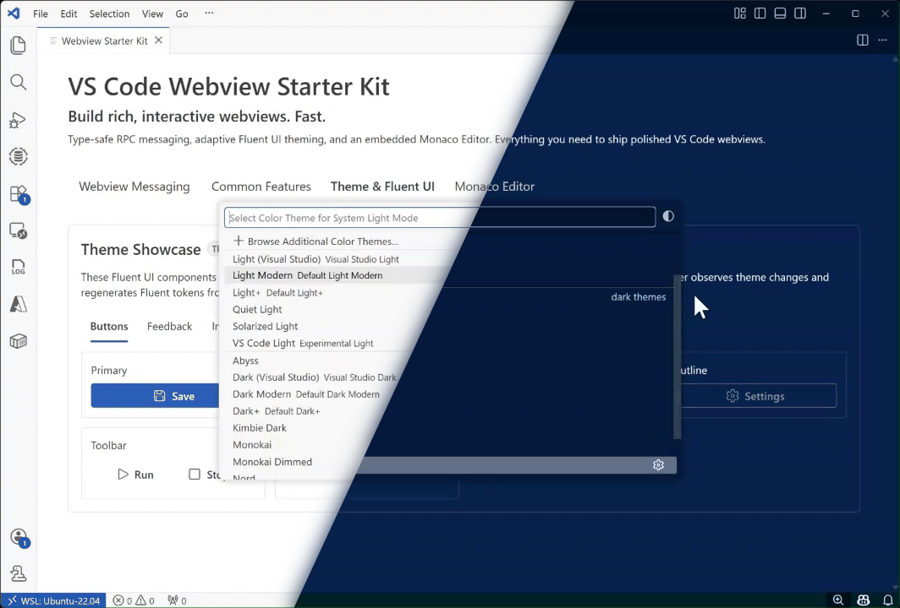
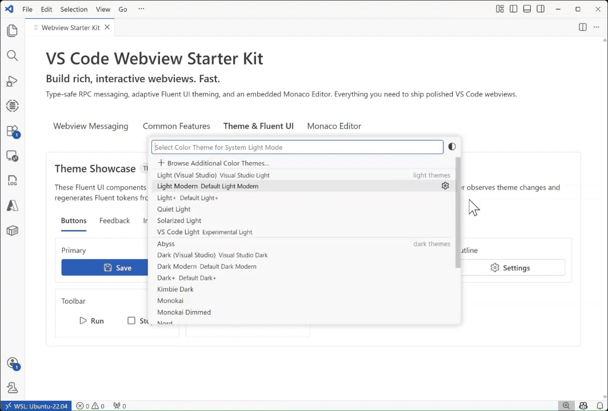

# VS Code Webview Starter Kit

<p align="center"></p>

Build rich, interactive VS Code webviews, fast. This starter kit gives you **type-safe RPC messaging**, **React + Fluent UI** with **adaptive theming**, and an embedded **Monaco Editor**, all wired up and ready to go.

This project was extracted from the webview infrastructure powering [DocumentDB for VS Code](https://github.com/microsoft/vscode-documentdb/) Extension and [Azure Cosmos DB](https://github.com/microsoft/vscode-cosmosdb/) Extension. It provides a production-tested foundation for building VS Code webviews with React.

> **New here, or evaluating this for your team?** Start with
> [docs/webview-packages-overview.md](docs/webview-packages-overview.md), a short brief on the two
> npm packages (`@microsoft/vscode-ext-webview` and `@microsoft/vscode-ext-webview-fluentui`), what each
> one is for, why the tRPC approach makes webview code easier to read, and how two shipping extensions
> consume the core package with completely different build stacks.

## Table of Contents

- [Features](#features)
- [Try the Demo](#try-the-demo)
- [Component Showcase](docs/component-showcase.md)
- [Getting Started](#getting-started)
- [Project Structure](#project-structure)
- [Development](#development)
- [Debugging](#debugging)
- [Architecture](#architecture)
- [Under the Hood](#under-the-hood)
- [Copilot Skills](#copilot-skills)
- [Adding a New View](#adding-a-new-view)
- [Advanced](#advanced)
- [FAQ](#faq)
- [Limitations](#limitations)
- [License](#license)

## Features

- **Type-safe RPC** - End-to-end typed communication between extension host and webview via `postMessage` (powered by [tRPC](https://trpc.io/))
- **React + Fluent UI** - Modern UI components with VS Code theme integration
- **Adaptive theming** - Automatic theme adaptation using `VSCodeFluentProvider`
- **Component Showcase** - [Six package component families, 16 exports](docs/component-showcase.md), with interactive layout, wizard, status, metrics, and keyboard-accessible badge examples
- **Monaco Editor** - Embedded editor with shared VS Code theme mapping from the package's `/monaco` entry
- **Subscriptions & Abort** - Real-time data streaming and cancellable long-running operations
- **Localization** - Full `@vscode/l10n` integration

## Try the Demo

A pre-built `.vsix` package is available so you can try the extension without cloning or building the project:

1. Go to the [v2.0.0 release page](https://github.com/tnaum-ms/vscode-webview-starter-kit/releases/tag/v2.0.0)
2. Download the `.vsix` file from the **Assets** section
3. In VS Code, open the Command Palette (`Ctrl+Shift+P`) and run:
   > **Extensions: Install from VSIX…**
4. Select the downloaded `.vsix` file
5. Once installed, open the Command Palette and run:
   > **Webview Starter Kit: Open Main View**

To uninstall later, find the extension in the Extensions sidebar and click **Uninstall**.

### Try the Component Showcase

The **v2.0.0 VSIX does not include the new showcase**. Use the current source and a new build:
follow [Getting Started](#getting-started) and press **F5**. For the easiest discovery,
select the **Component Showcase** tab in the Main View: its explanatory text introduces
the samples, and **Open Component Showcase** opens them in a separate panel.
In **Layout & navigation**, choose **Open wizard demo** to launch the full-viewport
**Wizard demo** webview (`showcaseWizard`), independently of the showcase tabs.
Its DocumentDB Local-inspired flow has three navigation markers: **Introduction**,
**Configure**, and **Set up**, with the completion receipt below the setup stages.
All five stages are mocked, advancing every 900 ms; setup runs no commands,
downloads, network requests, or file writes.

The Main View keeps its original compact demos, with a short showcase introduction
and launch button. Component descriptions and documentation links live in the
showcase. StepList, StatusList, service metrics, and badges each have independent
**Preview config** controls and a dashed preview with its **Component preview**
heading outside the border. Metrics and badges occupy separate sections within
**Metrics & badges**; badges use `shape="rounded"` throughout the starter kit, and
the badge preview includes a **Keyboard focus** toggle.

Direct Command Palette shortcuts are **Webview Starter Kit: Open Component Showcase**
and **Webview Starter Kit: Open wizard demo**.

For the standalone browser preview, run `npm run watch:views` and open
http://127.0.0.1:18080/static/component-showcase.html (default: `componentShowcase`).
Open http://127.0.0.1:18080/static/component-showcase.html?view=showcaseWizard for
**Wizard demo**, or use `?view=mainView` for the Main View;
the minimal tRPC launch mock allowlists launch procedures and rejects unsupported
procedures. Browser interaction does not exercise the real Extension Host or webview CSP. See the
[component guide](docs/component-showcase.md) for the catalog, workflows, and upstream visuals.

## Getting Started

```bash
npm install
npm run build
```

Press **F5** to launch the extension in a new VS Code window. The main webview opens automatically on activation.

To reopen it manually (e.g. after closing the panel), use the Command Palette (`Ctrl+Shift+P`):

> **Webview Starter Kit: Open Main View**

## Project Structure

| Folder                                 | Purpose                                                                                                                                                                                      |
| -------------------------------------- | -------------------------------------------------------------------------------------------------------------------------------------------------------------------------------------------- |
| `src/`                                 | Extension host source code                                                                                                                                                                   |
| `src/webviews/`                        | React webview components                                                                                                                                                                     |
| `src/webviews/_integration/`           | Consumer-owned glue over the [`@microsoft/vscode-ext-webview`](https://www.npmjs.com/package/@microsoft/vscode-ext-webview) package (root router, telemetry adapter, panel preset, registry) |
| `src/webviews/components/`             | Consumer-owned Monaco wrapper and accessibility helpers; theme derivation comes from the package's `/monaco` entry                                                                           |
| `src/webviews/demo/`                   | Demo webview views                                                                                                                                                                           |
| `src/webviews/demo/componentShowcase/` | Interactive examples of all six packaged component families                                                                                                                                  |
| `src/webviews/static/`                 | Standalone browser preview HTML                                                                                                                                                              |
| `src/commands/`                        | Command handlers                                                                                                                                                                             |
| `l10n/`                                | Localization bundles                                                                                                                                                                         |

> The type-safe RPC transport (tRPC over `postMessage`), the panel facade, and
> the React hooks are provided by version 0.10.1 of the
> **`@microsoft/vscode-ext-webview`** package, and adaptive Fluent UI theming,
> reusable components, and Monaco theme mapping by its sibling
> **`@microsoft/vscode-ext-webview-fluentui`** (`~1.1.0`). See
> [migration.md](migration.md) for the current package-based target architecture.

## Development

| Command                | Purpose                         |
| ---------------------- | ------------------------------- |
| `npm run build`        | TypeScript compilation          |
| `npm run webpack-dev`  | Webpack development build       |
| `npm run watch:ext`    | Watch extension code            |
| `npm run watch:views`  | Watch webview code (dev server) |
| `npm run lint`         | Run ESLint                      |
| `npm run prettier-fix` | Format code                     |
| `npm run test`         | Run Jest tests                  |
| `npm run l10n`         | Rebuild localization bundles    |

### Activation Events

This starter kit uses a wildcard activation event for demo convenience:

```json
"activationEvents": [
    "*"
]
```

This causes the extension to activate **on every VS Code startup**, which negatively impacts startup performance. It is used here only so that demo commands are immediately available without requiring a specific trigger.

For a production extension, replace `"*"` with scoped activation events (e.g., `onCommand:`, `onView:`, `onLanguage:`) that match your actual usage. See the [Activation Events documentation](https://code.visualstudio.com/api/references/activation-events) for the full list of supported events.

### Hot Reloading

Webview code supports **hot reloading** during development. When you run the `watch:views` task (or the combined `Watch` task), changes to React components, styles, and other webview source files are automatically reflected in the running webview - no need to reload the extension host or reopen the panel.

> **Tip:** Run both watchers together with the **Watch** task for the best experience. Extension host code changes still require a restart (`Ctrl+Shift+F5`).

## Debugging

Press **F5** to launch the extension in a new VS Code window using the **Launch Extension (webpack)** configuration.

### Extension Host

The extension host code (Node.js) can be debugged directly in VS Code using breakpoints. Note that the `STOP_ON_ENTRY` environment variable in `launch.json` can be set to `"true"` to pause execution at the first line of the `activate()` function. This is needed to debug activation code because the environment takes a long time to load, and regular breakpoints in activation code would not be hit otherwise.

### Webviews

Webview code (React/browser) **cannot** be debugged with VS Code breakpoints. Instead, open the Developer Tools in the Extension Host VS Code window (**Help > Toggle Developer Tools**, or `Ctrl+Shift+I`) and use the browser-style debugger there to inspect and debug webview code.

## Architecture

The starter kit demonstrates a clean separation between the VS Code extension host (Node.js) and webview UI (browser):

```
Extension Host (Node.js)           Webview (Browser)
┌──────────────────────┐           ┌───────────────────────┐
│  WebviewController   │◄─────────►│  React + Fluent UI    │
│  tRPC Router         │  postMsg  │  tRPC Client          │
│  Procedures          │           │  VSCodeFluentProvider │
└──────────────────────┘           └───────────────────────┘
```

## Under the Hood

This starter kit solves several challenges that arise when running a React application inside a VS Code webview.

### Dual Webpack Builds

The project uses **two separate webpack configurations**: one for the extension host (Node.js, `webpack.config.ext.js`) and one for the webview (browser, `webpack.config.views.js`). This ensures that Node.js-specific code never leaks into the browser bundle, and vice versa.

### tRPC over postMessage

VS Code webviews communicate with the extension host through `window.postMessage`. The [`@microsoft/vscode-ext-webview`](https://www.npmjs.com/package/@microsoft/vscode-ext-webview) package wraps that raw messaging channel with tRPC using a custom link adapter (`vscodeLink`), giving you:

- Full TypeScript type inference from router definition to React component
- Automatic serialization and deserialization
- Support for queries, mutations, and subscriptions
- Built-in abort/cancellation support via `AbortSignal`

### Adaptive Theming

`VSCodeFluentProvider`, from [`@microsoft/vscode-ext-webview-fluentui`](https://www.npmjs.com/package/@microsoft/vscode-ext-webview-fluentui), reads VS Code's CSS custom properties (e.g., `--vscode-editor-background`) at runtime and generates a matching Fluent UI theme. When the user switches VS Code themes, the webview updates automatically without a reload.

The [webview entry point](src/webviews/index.tsx) imports the provider from the package
root, which injects document-global adaptive CSS once. The public `/components` and
`/monaco` entries do not inject that stylesheet; do not deep-import package CSS or source.
The components can also use a standard Fluent UI v9 `FluentProvider` without adaptive theming.

The [Monaco wrapper](src/webviews/components/MonacoEditor.tsx) uses `useVSCodeMonacoTheme`
from `/monaco`, registers the theme before editor creation, and reapplies it when colors
change, including switches between two dark themes or edits to `workbench.colorCustomizations`.
The package supplies theme data without importing Monaco; consumers still own the editor,
loader/workers, and focus handling. See [Component Showcase](docs/component-showcase.md)
for import examples and integration boundaries.

<p align="center"></p>

### Content Security Policy

The framework's `WebviewController` generates a strict CSP header for each webview panel. Only resources from the extension's own directory and the webview's `cspSource` are allowed, following [VS Code's security best practices](https://code.visualstudio.com/docs/extensions/webview#_security).

Fluent UI's Griffel and the adaptive package stylesheet inject runtime styles, so the
style policy must allow `style-src 'unsafe-inline'`. This is a style requirement, not a
reason to relax script restrictions; see the [upstream CSP guidance](https://github.com/microsoft/vscode-documentdb/blob/4540d86c7371e8e708fb1c9a1c7f75dc7c2a07c2/packages/vscode-ext-webview-fluentui/README.md#things-to-know-before-you-adopt-it).

## Copilot Skills

This repository ships with **GitHub Copilot skills** — structured knowledge files in `.github/skills/` that teach Copilot the project's architecture and conventions. When Copilot is active in this workspace, it automatically picks up these skills and applies them to your requests.

| Skill                          | File                                                           | What it covers                                                                                                                                                             |
| ------------------------------ | -------------------------------------------------------------- | -------------------------------------------------------------------------------------------------------------------------------------------------------------------------- |
| **react-webview-architecture** | [SKILL.md](.github/skills/react-webview-architecture/SKILL.md) | React component patterns, Fluent UI integration, state management (Context API), Monaco Editor usage, stale closure fixes, styling conventions                             |
| **webview-trpc-messaging**     | [SKILL.md](.github/skills/webview-trpc-messaging/SKILL.md)     | tRPC router creation, procedure definitions (queries, mutations, subscriptions), WebviewController wiring, WebviewRegistry, telemetry middleware, AbortSignal cancellation |

With these skills in place, you can ask Copilot to create a new webview, add a tRPC procedure, or wire up a controller, and it will follow the same patterns used throughout the codebase — producing code that compiles and integrates correctly on the first try.

## Adding a New View

The Copilot skills described above understand the full process for creating webviews. When you ask GitHub Copilot to create a new webview, the skills guide it through the entire process automatically.

To learn the pattern yourself — or to see exactly what each step touches — the repository history contains a **worked, commit-by-commit tutorial** that builds the demo **Basic View** from nothing on `@microsoft/vscode-ext-webview` 0.10.0. Start from the [baseline commit](https://github.com/tnaum-ms/vscode-webview-starter-kit/commit/d072e6acad60e365eabc00bf2df303cf29b68afe) (the repo with only the Main View), then read the four step commits below in order. Each is small, self-contained, and compiles on its own:

| Step                                | Commit                                                                                                              | What it adds                                                                                                                         | Key files                                                                                                                                                                     |
| ----------------------------------- | ------------------------------------------------------------------------------------------------------------------- | ------------------------------------------------------------------------------------------------------------------------------------ | ----------------------------------------------------------------------------------------------------------------------------------------------------------------------------- |
| **1. Scaffold**                     | [`de881c9`](https://github.com/tnaum-ms/vscode-webview-starter-kit/commit/de881c9f8d3d791729b66b6bf52ddea97ea42d0d) | The component, styles, an empty router, and registration so the view can render.                                                     | `demo/basicView/BasicView.tsx`, `basicView.scss`, `basicViewController.ts`, `basicViewRouter.ts`; register in `_integration/WebviewRegistry.ts` + `_integration/appRouter.ts` |
| **2. Command & navigation**         | [`c4e4b01`](https://github.com/tnaum-ms/vscode-webview-starter-kit/commit/c4e4b01d834c748e36240b0ab157739c1e59de68) | A VS Code command to open the view (palette + `package.json`), plus a link from the Main View that opens it through a tRPC mutation. | `commands/openBasicView.ts`, `extension.ts`, `package.json`, `mainView/mainViewRouter.ts`, `mainView/MainView.tsx`                                                            |
| **3. Client-side interaction**      | [`a56b8a6`](https://github.com/tnaum-ms/vscode-webview-starter-kit/commit/a56b8a6415c4479c1fecf6a194f28bb1b81a30a1) | A button and a message rendered from local React state (`useState`) — no extension-host round-trip yet.                              | `demo/basicView/BasicView.tsx`, `basicView.scss`                                                                                                                              |
| **4. Extension host communication** | [`ef4c2dc`](https://github.com/tnaum-ms/vscode-webview-starter-kit/commit/ef4c2dce6361bc2b4a3d94e4e54a0cd91226526c) | A `hello` tRPC query on the router, with the button wired to call it and display the result. Adds a router unit test.                | `demo/basicView/basicViewRouter.ts`, `BasicView.tsx`, `_integration/appRouter.test.ts`                                                                                        |

Read in order, the four commits show the whole data path come together: **register → open → local state → typed tRPC call**. The end state of Step 4 is exactly the Basic View that ships in this repository.

### Typical steps

When creating a new webview manually, these are the files and registrations involved (the same ones the tutorial commits above touch):

1. Create a new folder under `src/webviews/demo/yourView/`
2. Add a React component (`YourView.tsx`)
3. Add a tRPC router (`yourViewRouter.ts`)
4. Add a panel factory (`yourViewController.ts`) that calls `openAppWebview`
5. Register the component in `_integration/WebviewRegistry.ts`
6. Wire the router into `_integration/appRouter.ts`
7. Add a command handler (`src/commands/openYourView.ts`) and register it in `extension.ts` and `package.json`

## Advanced

### The tRPC client is a per-webview singleton

`useTrpcClient()` (from `@microsoft/vscode-ext-webview/react`, re-exported
typed via `src/webviews/_integration/useTrpcClient.ts`) returns the client
**directly** and shares a single instance across every component in a webview:

```tsx
export const MyComponent: React.FC = () => {
  const trpcClient = useTrpcClient();
  // ...
};
```

Because the client is shared per webview, there is no provider tree to wire up and no per-component client fan-out to worry about — every component that calls the hook receives the same instance, and cross-cutting observers see every call. (The transport itself registers one `window` `message` listener per in-flight operation and removes it when the call settles, so listeners scale with the number of concurrent calls, not with the number of components.)

For webview-wide observation of query/mutation outcomes (success, error,
aborted), subscribe through `useRpcEvents()` from
`@microsoft/vscode-ext-webview/react` rather than wrapping every call site. To
log every call to the webview devtools console, pass `enableRpcLogging` to
`WithWebviewContext`. See the package's
[README](https://www.npmjs.com/package/@microsoft/vscode-ext-webview) and
ADVANCED.md for the full observability surface.

## FAQ

### Why tRPC instead of raw postMessage?

Raw `postMessage` requires you to define message types manually, match request/response pairs, and handle serialization yourself. tRPC provides end-to-end type safety, so your extension host procedures and webview calls share the same TypeScript types with zero code generation. If you rename a field on the server, the client shows a compile error immediately.

### Can I use a different UI framework instead of Fluent UI?

Yes. The tRPC messaging layer and the webview controller infrastructure are independent of the UI library. You can replace Fluent UI with any React component library. `VSCodeFluentProvider` is Fluent UI-specific, so you would need to adapt the theming approach for your chosen framework.

### How do I persist state when the webview is hidden?

VS Code may dispose of a webview's content when it is moved to a background tab. Use the `retainContextWhenHidden` option in `WebviewController` to keep the webview alive, or store state on the extension host side and re-send it when the webview is re-created.

### Can I have multiple webview panels open at the same time?

Yes. Each call to `WebviewController.createWebviewPanel()` opens an independent panel with its own tRPC server instance. State is not shared between panels unless you explicitly coordinate through the extension host.

### How do I add an npm dependency to the webview?

Install the package normally with `npm install`. If the package is used only in webview code, it will be bundled by the webview webpack config automatically. If it is used only in extension host code, it will be bundled by the extension webpack config. Avoid importing the same package in both contexts unless it is a pure TypeScript types package.

## Limitations

- **No Node.js APIs in webview code.** Webview code runs in a sandboxed browser iframe. You cannot use `fs`, `path`, `child_process`, or other Node.js modules directly. Access platform capabilities through tRPC procedures on the extension host.
- **Webview debugging requires DevTools.** VS Code breakpoints do not work inside webview code. Use the browser Developer Tools (`Ctrl+Shift+I` in the Extension Host window) to inspect and debug.
- **Extension host changes need a restart.** Hot reloading applies only to webview code. Changes to extension host files (routers, controllers, commands) require restarting the Extension Development Host (`Ctrl+Shift+F5`).

## Published npm Packages

This starter kit's core webview infrastructure — the tRPC messaging layer, the
webview controller / panel facade, and the React hooks — now ships as a
standalone npm package:
[`@microsoft/vscode-ext-webview`](https://www.npmjs.com/package/@microsoft/vscode-ext-webview).
This repository is the canonical **all-in** (React + tRPC + webview) reference
consumer of that package. Teams can adopt the patterns by installing the package
rather than forking or copying the source.

See [migration.md](migration.md) for a focused guide to the current 0.10.1
package-based architecture and its consumer-owned integration layer.

Adaptive Fluent UI theming, six reusable component families (16 component exports),
and Monaco theme mapping ship as
[`@microsoft/vscode-ext-webview-fluentui`](https://www.npmjs.com/package/@microsoft/vscode-ext-webview-fluentui),
used here at `~1.1.0`. Its three public entries are `.`, `/components`, and `/monaco`.
Neither package depends on the other: theming reads the active theme off the DOM
and needs no transport, so each is adoptable on its own. Monaco is not a peer or
runtime dependency of the styling package; this repository keeps its own
[editor wrapper](src/webviews/components/MonacoEditor.tsx) and worker integration.
Explore the [Component Showcase guide](docs/component-showcase.md) for every shipped
component and its local example.

For a high-level overview of both packages, how they divide responsibilities, and
which integrations the DocumentDB and Azure Cosmos DB extensions use, see
[docs/webview-packages-overview.md](docs/webview-packages-overview.md).

## Contributors

This starter kit and the `@microsoft/vscode-ext-webview` package it builds on were a team effort:

- [**tnaum-ms**](https://github.com/tnaum-ms) assembled the starter kit, built the tRPC integration, built and shaped the [`@microsoft/vscode-ext-webview`](https://www.npmjs.com/package/@microsoft/vscode-ext-webview) npm package, and now uses it in the [DocumentDB for VS Code](https://github.com/microsoft/vscode-documentdb) extension.
- [**bk201-**](https://github.com/bk201-) built the dynamic theming system and, with sevoku, test-drove the package in the [Azure Cosmos DB for VS Code](https://github.com/microsoft/vscode-cosmosdb) extension, helping show the path toward a more modular design.
- [**guanzhousongmicrosoft**](https://github.com/guanzhousongmicrosoft) built the npm release pipelines that publish the package.
- [**sevoku**](https://github.com/sevoku) helped test-drive the package in [Azure Cosmos DB for VS Code](https://github.com/microsoft/vscode-cosmosdb) with bk201-, surfacing the modular direction.

Thanks to everyone who contributed ideas, reviews, and feedback along the way.

## License

See [LICENSE.md](LICENSE.md).
