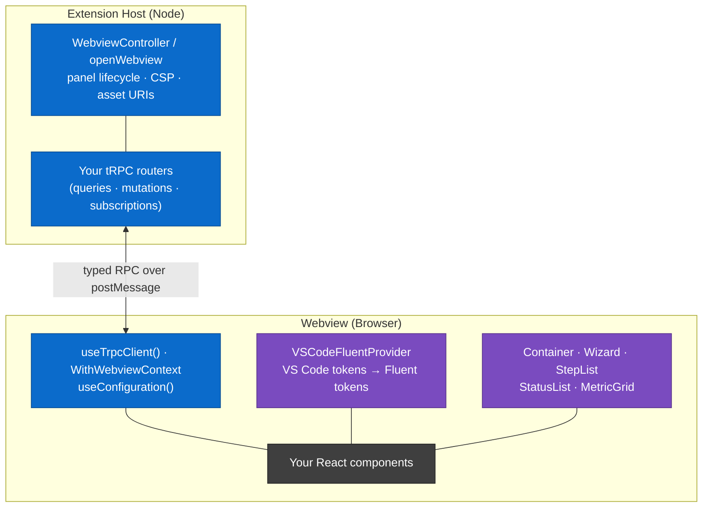

# Webviews for VS Code Extensions: Two Packages, One Foundation

_A short brief for teams building VS Code extensions with webviews._

---

## TL;DR

We published **two independent npm packages** that take the boring, error-prone parts of VS Code webviews off your plate:

| Package                                                                                                          | Version  | What it gives you                                                                                                                                   | What it does **not** do                                               |
| ---------------------------------------------------------------------------------------------------------------- | -------- | --------------------------------------------------------------------------------------------------------------------------------------------------- | --------------------------------------------------------------------- |
| [`@microsoft/vscode-ext-webview`](https://www.npmjs.com/package/@microsoft/vscode-ext-webview)                   | `0.10.1` | **The core.** Type-safe RPC over `postMessage` (tRPC), the panel/controller facade, CSP + resource wiring, dev-server/bundle switching, React hooks | No UI, no components, no theming, no opinion on your UI framework     |
| [`@microsoft/vscode-ext-webview-fluentui`](https://www.npmjs.com/package/@microsoft/vscode-ext-webview-fluentui) | `1.1.0`  | **The look.** Adaptive Fluent UI theming, six reusable component families (16 component exports), and Monaco theme data                             | No transport, no messaging, no extension-host code, no Monaco runtime |

Neither package depends on the other. Adopt one, the other, or both.



Blue = `@microsoft/vscode-ext-webview` · Purple = `@microsoft/vscode-ext-webview-fluentui` · Grey = your code.

### Package surface at a glance

`@microsoft/vscode-ext-webview` ships four entry points, so Node code never leaks into the browser bundle:

| Entry point | Imported from | Contains                                                                   |
| ----------- | ------------- | -------------------------------------------------------------------------- |
| `.`         | either side   | Wire protocol types, `TypedEventSink`, `BaseRouterContext`                 |
| `/host`     | extension     | `WebviewController` / `openWebview`, telemetry + logging middleware bodies |
| `/webview`  | webview       | Framework-agnostic transport (no React)                                    |
| `/react`    | webview       | `useTrpcClient`, `useConfiguration`, `WithWebviewContext`, `useRpcEvents`  |

`@microsoft/vscode-ext-webview-fluentui` ships three public entries:

| Entry point    | Contains                                                                                                                                                    |
| -------------- | ----------------------------------------------------------------------------------------------------------------------------------------------------------- |
| `.`            | `VSCodeFluentProvider`, `createVSCodeFluentTheme`, `generateAdaptiveLight/DarkTheme`, `useActiveVSCodeTheme`, `useActiveVSCodeThemeKind`                    |
| `./components` | `Container` and its six parts, `Wizard`/`WizardStep`, `StepList`/`StepListItem`, `StatusList`/`StatusListItem`, `MetricGrid`/`MetricCard`, `FocusableBadge` |
| `./monaco`     | `createVSCodeMonacoTheme`, `useVSCodeMonacoTheme`, `DEFAULT_MONACO_THEME_NAME`, and theme/option types                                                      |

The root import injects adaptive Fluent overrides once per document. `/components`
and `/monaco` inject no stylesheet; components work under any Fluent UI v9
`FluentProvider`, and Monaco theme data has no Monaco runtime dependency. Import
only these public entries, never deep CSS or source paths. Runtime styles from
Griffel and the root entry require `style-src 'unsafe-inline'` in the webview CSP.

The [Component Showcase guide](component-showcase.md) lists all 16 component exports
in six families, with local examples, upstream family docs, and screenshots. These
are additions to Fluent UI, not a count of standard `@fluentui/react-components` controls.

---

## Why tRPC: the part that actually matters day to day

Raw `postMessage` forces you to hand-write a message enum, a request/response correlation scheme, serialization, and a `switch` statement on both sides. The request lives in one file, the handler in another, the response type in a third. Rename a field and you find out at runtime.

With the core package, a full round trip is **one function on the host** and **one call in the component**, fully typed, with no code generation.

**Host side.** The accepted input, the work, and the returned shape all sit in a single procedure:

```ts
// host: myViewRouter.ts
export const myViewRouter = router({
  loadRows: publicProcedure

    // The accepted request: this procedure takes a { page: number }.
    // Anything else is rejected before your handler runs.
    .input(z.object({ page: z.number() }))

    // The handler: plain extension-host code. `ext` is your usual
    // extension-wide singleton, so this reads like a local call.
    .query(async ({ input, signal }) => {
      // `signal` is an AbortSignal: if the webview cancels or the panel
      // closes, pass it down and the work stops.
      const rows = await ext.myService.fetchPage(input.page, { signal });

      // The returned shape. This is what the webview gets, fully typed.
      // No DTO to declare, no message id to invent.
      return { rows, hasMore: rows.length === PAGE_SIZE };
    }),
});
```

**Webview side.** The call, the success path, and the failure path are one block:

```tsx
// webview: MyView.tsx
try {
  // The request. `page` is type-checked against the router's input schema.
  const result = await trpcClient.myView.loadRows.query({ page: 2 });

  // The response. `result.rows` and `result.hasMore` are inferred from the
  // procedure's return value, with no shared interface to keep in sync.
  setRows(result.rows);
  setHasMore(result.hasMore);
} catch (error) {
  // The failure path. Anything the host procedure throws surfaces here as a
  // rejected promise, including validation errors from the input schema.
  const message = error instanceof Error ? error.message : String(error);
  setErrorMessage(message);
}
```

That is the whole point: **request, response, and error handling are one readable unit**, instead of a message enum in one file, a `switch` case in another, and an error channel nobody wired up.

Three concrete wins:

1. **Locality.** Call, response, and failure handling are readable in one place. In an AI-assisted world we write less code and _read_ more of it, so code review and comprehension are now the bottleneck, and locality is what makes both cheap. (Humans benefit most here. 🙂)
2. **End-to-end types.** Rename a field on the host and the webview fails to compile. No generated clients, no drift.
3. **The hard parts are already handled.** Queries, mutations, **subscriptions** (streaming), and **`AbortSignal` cancellation** for long-running work, plus CSP, nonces, asset URIs, dev-server vs. bundled resolution, and pluggable telemetry/logging middleware.

---

## Two production extensions, two very different stacks, same core package

This is the key point for adoption: **the packages do not dictate your build, your styling, or your folder layout.**

|                  | [DocumentDB for VS Code](https://github.com/microsoft/vscode-documentdb)   | [Azure Cosmos DB for VS Code](https://github.com/microsoft/vscode-cosmosdb)                              |
| ---------------- | -------------------------------------------------------------------------- | -------------------------------------------------------------------------------------------------------- |
| **Bundler**      | Webpack 5 + SWC (`webpack.config.ext.js` / `.views.js`)                    | **Vite 8** + `@vitejs/plugin-react` (`vite.config.ext.mjs` / `.views.mjs`) + custom plugins              |
| **Dev loop**     | `webpack-dev-server` + React Refresh, `localhost:18080`                    | Vite dev server + HMR, `localhost:18080`                                                                 |
| **Styling**      | SCSS (+ global Fluent overrides)                                           | **Griffel `makeStyles`** (CSS-in-JS)                                                                     |
| **Repo shape**   | npm **workspaces monorepo** (`packages/*`, incl. the package's own source) | Single package                                                                                           |
| **Glue layer**   | Dedicated `src/webviews/_integration/` folder                              | Spread across `src/panels/trpc/` (host) and `src/webviews/` (client), with **no** `_integration/` folder |
| **Panels**       | 4 (collection, document, local quick start, Atlas credentials)             | 4 (query editor, document, account overview, migration assistant)                                        |
| **RPC scale**    | Several routers, incl. per-tab sub-routers                                 | ~60+ procedures across 7+ routers, incl. subscription routers                                            |
| **Tests**        | Jest + `jest-mock-vscode`                                                  | Vitest + Playwright (e2e)                                                                                |
| **Core package** | `@microsoft/vscode-ext-webview` (workspace build of `0.10.1`)              | `@microsoft/vscode-ext-webview` `~0.10.0` from npm                                                       |

Both ship real products. Both consume the same transport, controller, and hooks. One is Webpack + SCSS + monorepo; the other is Vite + Griffel + custom Vite plugins for Monaco workers and CSP-safe asset inlining. **Pick whatever build stack you already have.**

---

## Theming: why we should all use the _same_ mapping

Fluent UI has its own design tokens. VS Code exposes its theme as CSS custom properties (`--vscode-editor-background`, and ~200 more). Somebody has to map one onto the other, and the mapping is a judgement call, not a lookup table.

If each extension invents its own mapping, our extensions will drift apart the moment a user switches to a non-default theme: different greys, different accent derivation, different contrast in high-contrast themes. Users see the inconsistency inside one window, side by side.

`VSCodeFluentProvider` is that mapping, extracted and shared. It reads the active theme off the DOM at runtime and regenerates the Fluent theme when the user switches themes: **no reload, no transport dependency**. That is why the theming package is standalone, and you can adopt it even if you never touch tRPC.

> **Adoption status.** The starter kit consumes `~1.1.0` from npm. DocumentDB uses
> the workspace styling package following [PR #895](https://github.com/microsoft/vscode-documentdb/pull/895).
> Cosmos DB's styling-package migration is not established by the evidence here;
> its transport-package adoption does not imply styling-package adoption.

### Monaco theming: packaged, consumer-applied

The `/monaco` entry derives editor theme data from the same live VS Code colors
as Fluent theming. `useVSCodeMonacoTheme()` reacts to color changes, including
switches between two dark themes and `workbench.colorCustomizations` edits.
The [starter kit wrapper](../src/webviews/components/MonacoEditor.tsx) registers
the theme before editor creation and reapplies updated data after mount.

The package neither imports nor requires `monaco-editor`; consumers still own
installation, loader/workers, layout, focus handling, and applying the theme.
See the [upstream Monaco guide](https://github.com/microsoft/vscode-documentdb/blob/4540d86c7371e8e708fb1c9a1c7f75dc7c2a07c2/packages/vscode-ext-webview-fluentui/src/monaco/README.md)
and the [component family guide](component-showcase.md) instead of copying deleted local derivation code.

---

## The starter kit: a worked example, _not_ the best practice

👉 https://github.com/tnaum-ms/vscode-webview-starter-kit

**Read this the right way:** the **packages** are the best practice. The starter kit is one runnable demonstration of them. It happens to use Webpack, SCSS, a `_integration/` folder, and `activationEvents: ["*"]` (for demo convenience only, don't copy that). Cosmos DB proves you can throw all of that away and keep the packages.

What the starter kit is genuinely good for:

- **A running demo** of queries, mutations, subscriptions, abort/cancellation, error handling, adaptive theming, and Monaco. There's a prebuilt `.vsix` on the releases page if you just want to click around.
- **A component showcase** of all six styling-package families (16 exports). The Main View retains its original compact demos, plus a short **Component Showcase** introduction and **Open Component Showcase** button. Component descriptions and documentation links live in the showcase. StepList, StatusList, service metrics, and badges each have independent **Preview config** controls and a dashed sample with its **Component preview** heading outside the border. Metrics and badges occupy separate regions in **Metrics & badges**; the badge region has a **Keyboard focus** toggle. All starter-kit badges use `shape="rounded"`.
- **A dedicated Wizard demo.** In **Layout & navigation**, **Open wizard demo** opens the full-viewport `showcaseWizard` panel titled **Wizard demo**; **Webview Starter Kit: Open wizard demo** is the direct command. Inspired by DocumentDB Local, it has four navigation markers: **Introduction**, **Configure**, **Set up**, and **Done**. Numbered introduction discs and a settings summary table cover the address, image, optional credentials, and sample data. Host ports accept whole numbers from **1024-65535**, and enabled custom credentials require both fields. Completion advances to a separate Done step with the finished status list, next steps, settings summary, and example endpoint. Footer labels and status details reserve their geometry across state changes. **Learn more** opens a VS Code information dialog through tRPC. All five setup stages are mocked at 900 ms each: no commands, downloads, network requests, or file writes run. The [showcase guide](component-showcase.md) covers composition, validation, and state.
- **A commit-by-commit tutorial.** The README walks you through building a webview from nothing in four small, self-contained commits: _scaffold_, then _command & navigation_, then _local React state_, then _typed tRPC call_. Each one compiles on its own, so you can read the whole data path come together instead of reverse-engineering a finished app. Start from the baseline commit linked in the README's [Adding a New View](https://github.com/tnaum-ms/vscode-webview-starter-kit#adding-a-new-view) section.
- **Copilot skills that build webviews for you.** The repo ships three skills under `.github/skills/`:
  - **`webview-trpc-messaging`**: creating routers and procedures (queries, mutations, subscriptions), wiring the controller, telemetry middleware, `AbortSignal` cancellation.
  - **`react-webview-architecture`**: React state, rendering, adaptive provider setup, Monaco usage, styling conventions, and stale-closure pitfalls.
  - **`webview-fluentui-components`**: the six shared component families, controlled-state contracts, keyboard behavior, accessible labels, and live-announcement guidance.

  Ask Copilot for "a new webview with a router and a command" in that workspace and it follows the same patterns end to end. **You can copy these skills into your own repo**, since they describe the package APIs, not starter-kit trivia.

The showcase and wizard require current source or a new build, not the v2.0.0 VSIX.
After `npm run watch:views`, open http://127.0.0.1:18080/static/component-showcase.html
(default `componentShowcase`), or append `?view=mainView` or `?view=showcaseWizard`.
The wizard route has the title **Wizard demo**. The browser launch mock allowlists
launch procedures and rejects unsupported ones; it does not exercise the real
Extension Host or webview CSP. Browser geometry validation is separate from these
source-based documentation updates.

---

## What we're asking for

1. Take the **core package** for anything with a webview. It removes the messaging boilerplate and makes the code readable.
2. Take the **fluentui package** for theming, so we all land on the same VS Code → Fluent mapping before users notice the drift.
3. Keep your bundler, your styling, your folder layout. Two shipping extensions already prove the packages don't care.
4. Steal the skills and the tutorial commits. That's the fastest path from zero to a working panel.

---

## For your agent

_Paste this section (or the whole document) into your coding agent so it can answer follow-ups and start the migration._

### Install

```bash
npm install @microsoft/vscode-ext-webview
npm install @microsoft/vscode-ext-webview-fluentui@~1.1.0   # optional: Fluent theming, components, Monaco theme data
```

Peer deps for the fluentui package: `@fluentui/react-components ~9.74`, `@fluentui/react-icons ~2.0`, `react >=19`.
The core package pairs with `@trpc/server` / `@trpc/client` `11.x` and `zod` `4.x`.

### Import rules (bundling correctness)

- Extension-host code uses `@microsoft/vscode-ext-webview/host` (pulls in `vscode`, `fs`, `path`, so it must never reach the browser bundle).
- Webview code uses `@microsoft/vscode-ext-webview/react` (React) or `/webview` (framework-agnostic).
- Shared types (router context, wire types) come from `@microsoft/vscode-ext-webview`.
- Two bundles, always: one `target: node` for the host, one `target: web` for the views. Both example repos do this (Webpack in DocumentDB, Vite in Cosmos DB).

### Reference files in the starter kit (this repo)

| Concern                                       | File                                                                                                                                                                                                                               |
| --------------------------------------------- | ---------------------------------------------------------------------------------------------------------------------------------------------------------------------------------------------------------------------------------- |
| Root tRPC router, merging per-view routers    | [src/webviews/\_integration/appRouter.ts](../src/webviews/_integration/appRouter.ts)                                                                                                                                               |
| tRPC instance + telemetry middleware adapter  | [src/webviews/\_integration/trpc.ts](../src/webviews/_integration/trpc.ts)                                                                                                                                                         |
| Host-side panel preset (`openAppWebview`)     | [src/webviews/\_integration/openAppWebview.ts](../src/webviews/_integration/openAppWebview.ts)                                                                                                                                     |
| View id → React component registry            | [src/webviews/\_integration/WebviewRegistry.ts](../src/webviews/_integration/WebviewRegistry.ts)                                                                                                                                   |
| Typed `useTrpcClient` re-export               | [src/webviews/\_integration/useTrpcClient.ts](../src/webviews/_integration/useTrpcClient.ts)                                                                                                                                       |
| Bundle layout / dev-server config             | [src/webviews/\_integration/configuration.ts](../src/webviews/_integration/configuration.ts)                                                                                                                                       |
| Webview entry point                           | [src/webviews/index.tsx](../src/webviews/index.tsx)                                                                                                                                                                                |
| Smallest end-to-end view (the tutorial one)   | [src/webviews/demo/basicView/](../src/webviews/demo/basicView/BasicView.tsx)                                                                                                                                                       |
| Query / mutation / subscription / abort demos | [src/webviews/demo/mainView/components/tabs/MessagingTab/](../src/webviews/demo/mainView/components/tabs/MessagingTab/MessagingTab.tsx)                                                                                            |
| Monaco wrapper using packaged theme data      | [src/webviews/components/MonacoEditor.tsx](../src/webviews/components/MonacoEditor.tsx)                                                                                                                                            |
| Component catalog and local workflows         | [component-showcase.md](component-showcase.md)                                                                                                                                                                                     |
| Full-page local setup simulation              | [ShowcaseWizard.tsx](../src/webviews/demo/componentShowcase/ShowcaseWizard.tsx), [showcaseWizard.scss](../src/webviews/demo/componentShowcase/showcaseWizard.scss), [openShowcaseWizard.ts](../src/commands/openShowcaseWizard.ts) |
| Router unit test pattern                      | [src/webviews/\_integration/appRouter.test.ts](../src/webviews/_integration/appRouter.test.ts)                                                                                                                                     |
| Package-based target architecture             | [migration.md](../migration.md)                                                                                                                                                                                                    |
| Copilot skills                                | `.github/skills/webview-trpc-messaging/SKILL.md`, `.github/skills/react-webview-architecture/SKILL.md`                                                                                                                             |

### Reference files in the production extensions

**DocumentDB** (`microsoft/vscode-documentdb`, `main`), Webpack + SCSS + npm workspaces:

- `src/webviews/_integration/`: `appRouter.ts`, `trpc.ts`, `useTrpcClient.ts`, `WebviewRegistry.ts`, `openAppWebview.ts`, `configuration.ts`, `observability/`
- `packages/vscode-ext-webview-fluentui/`: the workspace styling package used by DocumentDB after [PR #895](https://github.com/microsoft/vscode-documentdb/pull/895), including Fluent theming, reusable components, and Monaco theme data; it replaces the earlier local theming stack.
- `src/webviews/documentdb/{collectionView,documentView,localQuickStart,atlasCredentials}/`: one folder per panel, each with `<View>.tsx` + `<view>Router.ts`
- `packages/vscode-ext-webview/`: the core package's own source and docs (`README.md`, `ADVANCED.md`, `MIGRATION.md`)
- Build: `webpack.config.ext.js`, `webpack.config.views.js`

**Cosmos DB** (`microsoft/vscode-cosmosdb`, branch `dev/tnuam/use-npm-webview-api`), Vite + Griffel:

- `src/panels/BaseTab.ts` + `QueryEditorTab.ts` / `DocumentTab.ts` / `AccountOverviewTab.ts` / `MigrationAssistantTab.ts`: host-side panel controllers
- `src/panels/trpc/`: `trpc.ts`, `appRouter.ts`, `middleware/azextTelemetryRunner.ts`, `middleware/outputChannelLogger.ts`, `routers/**`, `schemas/**`
- `src/webviews/WebviewRegistry.ts`: lazy-imported view id to component map
- `src/webviews/theme/`: local `DynamicThemeProvider.tsx` / `themeGenerator.ts` in this referenced branch; a migration to the styling package has not been verified here.
- Build: `vite.config.ext.mjs`, `vite.config.views.mjs`, plus `plugins/vite-plugin-monaco-workers.mjs`, `vite-plugin-no-extension-imports.mjs`, `vite-plugin-react-refresh-preamble.mjs`, `vite-plugin-webview-entry.mjs`

### Typical steps to add a webview

1. `src/webviews/<yourView>/YourView.tsx`: the React root component.
2. `yourViewRouter.ts`: a tRPC router; each procedure holds its input schema, handler, and return type together.
3. `yourViewController.ts`: host-side factory calling `openWebview` / `WebviewController`.
4. Register the component in your registry (view id → component) and merge the router into the app router.
5. Add a command in `src/commands/` + `package.json` `contributes.commands`, register it in `extension.ts`.
6. Add a router unit test.

### Gotchas worth knowing up front

- No Node APIs in webview code, everything platform-level goes through a tRPC procedure.
- VS Code breakpoints don't work in webview code; use the Extension Host window's DevTools (`Ctrl+Shift+I`).
- Hot reload covers webview code only; host changes need `Ctrl+Shift+F5`.
- `useTrpcClient()` returns a per-webview **singleton**, so there is no provider tree and no per-component client fan-out. For cross-cutting observation use `useRpcEvents()`; for console tracing pass `enableRpcLogging` to `WithWebviewContext`.
- Long-running procedures should accept and honour `signal` (`AbortSignal`) so the webview can cancel.
- Don't copy the starter kit's `activationEvents: ["*"]`, use scoped activation events.

### Further reading

- Core package: https://www.npmjs.com/package/@microsoft/vscode-ext-webview (README + `ADVANCED.md` + `MIGRATION.md`)
- Theming package: https://www.npmjs.com/package/@microsoft/vscode-ext-webview-fluentui
- Styling package [README](https://github.com/microsoft/vscode-documentdb/blob/4540d86c7371e8e708fb1c9a1c7f75dc7c2a07c2/packages/vscode-ext-webview-fluentui/README.md) and [component family guides](https://github.com/microsoft/vscode-documentdb/blob/4540d86c7371e8e708fb1c9a1c7f75dc7c2a07c2/packages/vscode-ext-webview-fluentui/src/components/README.md), pinned to source matching 1.1.0
- Local [Component Showcase](component-showcase.md)
- Starter kit README: https://github.com/tnaum-ms/vscode-webview-starter-kit#readme
